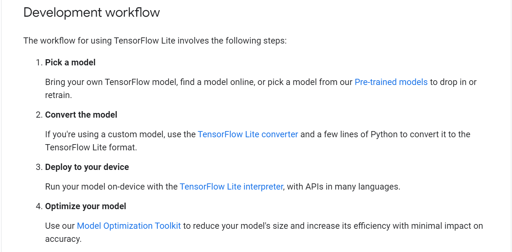

# COSC345 Group Project
COSC345 - Software Engineering Group Project 2021
### [Project Wiki](https://github.com/jordankettles/345-group-project/wiki/)

## Reading/Research Material
- Generative Adverserial Networks (GAN)
  - [GAN Wiki](https://en.wikipedia.org/wiki/Generative_adversarial_network)
  - The 3 video links found on thispersondoesnotexist explaining how it works: [Link1](https://www.youtube.com/watch?v=u8qPvzk0AfY), [Link2](https://www.youtube.com/watch?v=dCKbRCUyop8), [Link3](https://www.youtube.com/watch?v=SWoravHhsUU) <- I love "Two Minute Papers"
  - Github repo for Nvidia labs [StyleGAN2](https://github.com/NVlabs/stylegan2)
  - Github repo for the Nvidia labs [FFHQ Dataset](https://github.com/NVlabs/ffhq-dataset)
  - Original Paper on [StyleGAN](https://arxiv.org/pdf/1812.04948.pdf) which is what [thispersondoesnotexist](https://thispersondoesnotexist.com/) uses
  - Paper on [improvements made to StyleGAN](https://arxiv.org/pdf/1912.04958.pdf) 
  - Good [video](https://www.youtube.com/watch?v=Sw9r8CL98N0) on GAN by Computerphile
  - [Video](https://www.youtube.com/watch?v=RPGOPrkieTE) on how we can easily generate faces for ourselves
  - [Controlling Facial Properties](https://www.youtube.com/watch?v=5XX4uy9Mk9I&t=379s) at 9:00 mentions that it should be possible to only generate children
  - Simpler GAN's: [Simple for Pytorch](https://github.com/lucidrains/stylegan2-pytorch), [Lightweight](https://github.com/lucidrains/lightweight-gan)

- Open AI GPT
  - [GPT-3 Sandbox](https://github.com/shreyashankar/gpt3-sandbox)
  - [GPT Examples](https://gpt3examples.com/#examples)

- Mobile Machine Learning
  - [How to get Machine Learning on Mobile](https://blog.vsoftconsulting.com/blog/-how-to-get-machine-learning-abilities-on-mobile-apps)
  - [GPT-2 Andriod App](https://towardsdatascience.com/on-device-machine-learning-text-generation-on-android-6ad940c00911)
  - [State of AI on Mobile](https://blog.vsoftconsulting.com/blog/state-of-ai-on-android-and-ios) - includes how to steps for Andriod/iOS
  - 
    - From [TensorFlow Lite Guide](https://www.tensorflow.org/lite/guide)

## Problems To Solve
- Make the network generate faces in a specified age range
- How do we store these images on the app without the app size being very large (<50Mb would be good) 
- Investigate whether it's possible to create the images on the app, perhaps using [TensorFlow Lite](https://www.tensorflow.org/lite)
